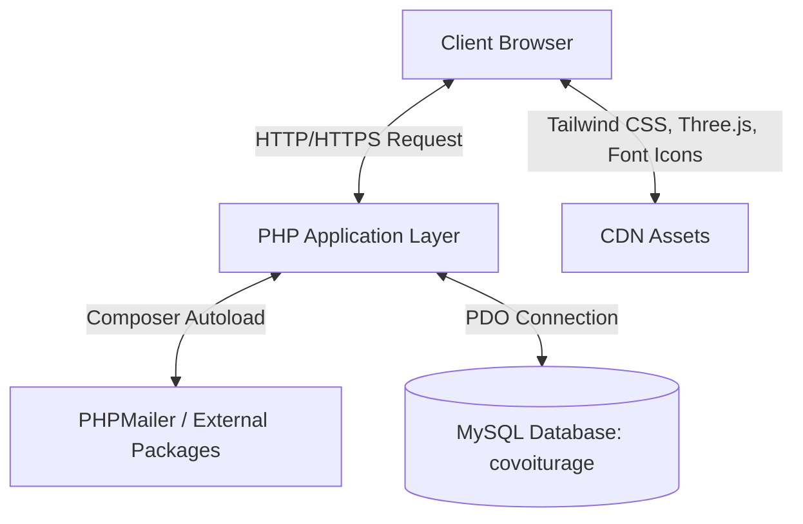
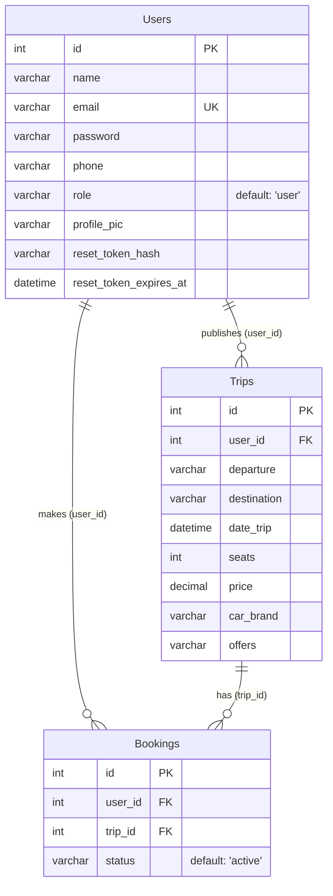

# Rydo Codebase Explanation

Welcome to the comprehensive technical documentation for **Rydo** (also known as *Cyber Covoiturage*), a next-generation, high-fidelity carpooling web application developed for Sidi Bouzid, Tunisia. 

This document provides a complete overview of Rydo's software architecture, database design, user workflows, security protocols, administrative systems, and full file-by-file explanations.

---

## 1. Architectural Overview

Rydo is built using a modern **LAMP-stack** inspired architecture with a clean, decoupled layer system. It combines robust server-side processing with highly immersive, futuristic UI aesthetics.

### Core Technologies
*   **Backend Engine**: PHP (Session-state management, OOP/procedural scripting, password cryptography).
*   **Database Connector**: PHP Data Objects (PDO) with strict error mode handling, parameterized prepared statements, and transactional capabilities.
*   **Database Management**: MySQL with custom transactional constraints and cascade-delete foreign keys.
*   **Styling & UI**: Tailwind CSS (Tailored futuristic configurations: dark mode, mint/purple glows) paired with custom Vanilla CSS for legacy and bespoke layouts.
*   **Visual Effects**: Three.js (WebGL rendering liquid shader drift backgrounds), responsive SVG route graphics, and Material 3-style micro-animations.
*   **Mail Engine**: Composer-managed PHPMailer library integrated with SMTP relays (Gmail TLS).

---

## 2. Database Schema (`covoiturage.sql`)

The database is named `covoiturage` and uses the `utf8mb4` character set with `utf8mb4_unicode_ci` collation for full Unicode support. It is comprised of three core tables linked via relational constraints.

### Tables Breakdowns
1.  **`Users`**: Holds registration data.
    *   `id`: Primary identifier (unsigned auto-increment).
    *   `name`: Complete full name of the user.
    *   `email`: Unique email identifier (used as username).
    *   `password`: Secure hashed access key using `PASSWORD_DEFAULT` (bcrypt).
    *   `phone`: Mobile signal/number.
    *   `role`: Level of authority ('user' or 'admin').
    *   `profile_pic`: Relative filepath pointing to the user's uploaded avatar.
    *   `reset_token_hash` & `reset_token_expires_at`: Cryptographic token hash and expiration date used for secure password recovery.
2.  **`Trips`**: Holds driver-submitted carpooling announcements.
    *   `id`: Primary identifier (unsigned auto-increment).
    *   `user_id`: Foreign key pointing to `Users(id)`. Deleting a user cascade-deletes all associated trips.
    *   `departure` / `destination`: Trip locations.
    *   `date_trip`: Scheduled departure datetime.
    *   `seats`: Available slots.
    *   `price`: Decimal price value (TND).
    *   `car_brand` / `offers`: Vehicle identification and extra passenger perks.
3.  **`Bookings`**: Holds reservations made by passengers.
    *   `id`: Primary identifier.
    *   `user_id`: Foreign key pointing to `Users(id)` (the passenger).
    *   `trip_id`: Foreign key pointing to `Trips(id)` (the ride).
    *   `status`: State of reservation ('active' or 'cancelled').

---

## 3. Directory & File Breakdown

Below is a detailed analysis of every file within the Rydo workspace.

### A. System Configuration & Core Setup

#### 1. [`db.php`](file:///C:/xampp/htdocs/project/db.php)
Establishes the database gateway. It instantiates a standard **PHP Data Object (PDO)** connection.
*   **Options Array**:
    *   `PDO::ATTR_ERRMODE => PDO::ERRMODE_EXCEPTION`: Configures PDO to throw exceptions on SQL failures, enabling clean `try-catch` logging.
    *   `PDO::ATTR_DEFAULT_FETCH_MODE => PDO::FETCH_ASSOC`: Simplifies SQL parsing by returning database rows as associative arrays.
    *   `PDO::ATTR_EMULATE_PREPARES => false`: Forces native database engine checks on queries rather than emulating them, mitigating SQL injections.

#### 2. [`covoiturage.sql`](file:///C:/xampp/htdocs/project/covoiturage.sql)
The blueprint for the database architecture. Contains table structures (`Users`, `Trips`, `Bookings`) using InnoDB engines with `FOREIGN KEY` cascade updates/deletions.

#### 3. [`composer.json`](file:///C:/xampp/htdocs/project/composer.json) & `composer.lock`
Declares the dependencies for third-party PHP packages. Specifically lists `phpmailer/phpmailer: ^7.0` for transactional email management.

---

### B. User Lifecycle & Authentication

#### 4. [`register.php`](file:///C:/xampp/htdocs/project/register.php)
The driver/passenger recruitment module.
*   **Duplicate Detection**: Performs a pre-flight database lookup check on `email`. If the email is already in use, it returns an HTTP `409 Conflict` status code and renders an alert offering to redirect the user to login.
*   **Password Cryptography**: Hashes the plain-text password using PHP’s `password_hash($pwd, PASSWORD_DEFAULT)` implementation before database write.
*   **Registration**: Inserts data into the `Users` table and redirects to `login.php`.

#### 5. [`login.php`](file:///C:/xampp/htdocs/project/login.php)
Authorized gateway to the application.
*   **Admin Bypass Override**: Contains a built-in backdoor for development and testing. Accessing with the credentials `admin@gmail.com` / `admin` directly logs the user into a session as `role => 'admin'` and redirects them to the administrative terminal (`admin_dashboard.php`).
*   **Verification**: Validates credentials using `password_verify()`. On success, it initializes `$_SESSION['user_id']` and `$_SESSION['user_name']` to track state globally.

#### 6. [`logout.php`](file:///C:/xampp/htdocs/project/logout.php)
Destroys all active session states (`session_start()`, `session_destroy()`) and returns the user to the landing portal (`index.php`).

#### 7. [`upload_profile.php`](file:///C:/xampp/htdocs/project/upload_profile.php)
Asynchronous profile image processor.
*   **Authentication Check**: Blocks unauthorized requests by returning a JSON message if a session isn't found.
*   **Security Filtering**: Restricts file uploads exclusively to `["jpg", "jpeg", "png", "webp"]` file extensions.
*   **Storage Routing**: Reorganizes file naming to prevent collisions: `profile_[user_id]_[timestamp].[extension]`, storing it under the `/uploads` folder and updating `Users.profile_pic`. Returns JSON response upon completion.

---

### C. Password Recovery Protocols

#### 8. [`forgot_password.php`](file:///C:/xampp/htdocs/project/forgot_password.php)
The initiation point for secure credentials retrieval.
*   **Token Generation**: Generates a 16-byte cryptographically secure random token (`random_bytes(16)`) and hashes it (`sha256`) for secure storage in the DB alongside a 30-minute expiry time (`reset_token_expires_at`).
*   **Mail Composition**: Utilizes **PHPMailer** to generate a premium responsive HTML email sent to the user's input email, pointing them to the reset link.
*   **Robust Fallback**: If standard SMTP relay fails, the system renders a test link in a local developer warning card, allowing password testing in local sandbox environments without needing internet or SMTP servers configured.

#### 9. [`reset_password.php`](file:///C:/xampp/htdocs/project/reset_password.php)
The terminal verification step for password restoration.
*   **Active Verification**: Receives the token via `$_GET['token']`, hashes it, and queries the database for a matching record that hasn't expired (`reset_token_expires_at > NOW()`).
*   **Update and Cleanup**: Confirms matching input keys, hashes the new password, clears the active tokens (`reset_token_hash = NULL`, `reset_token_expires_at = NULL` to prevent replay attacks), and offers links to log back in.

---

### D. Core Operations: Trips & Search

#### 10. [`add_trip.php`](file:///C:/xampp/htdocs/project/add_trip.php)
The ride-sharing publication terminal.
*   Allows verified drivers to propose a trip, entering `departure`, `destination`, `date`, `seats`, `price`, `car_brand`, and optional passenger perks like climate control or music.
*   Inserts the record into the `Trips` table under the active driver's session ID.

#### 11. [`search.php`](file:///C:/xampp/htdocs/project/search.php)
The central exploration engine for Rydo.
*   **Dynamic Query Generation**: Dynamically constructs SQL statements depending on what query filters are present (search by departure, destination, date).
*   **Material 3 Filter Chips**:
    *   `today`: Evaluates scheduled departures for the current calendar date (`DATE(T.date_trip) = CURDATE()`).
    *   `price`: Sorts SQL results by price ascending (`ORDER BY T.price ASC`).
    *   `seats`: Displays only trips that contain 2 or more available passenger vacancies.
*   **Dynamic UI**: Shows glowing route markers, custom verifications, and an elegant side drawer/modal populated dynamically with JavaScript for quick booking previews.

#### 12. [`my_trips.php`](file:///C:/xampp/htdocs/project/my_trips.php)
Displays all published rides created by the logged-in user, querying `Trips` where `user_id = $_SESSION['user_id']`.

---

### E. Booking Transactions

#### 13. [`book.php`](file:///C:/xampp/htdocs/project/book.php)
The reservation engine.
*   Queries the `Trips` database to ensure seat vacancies are greater than zero.
*   Inserts a new record in `Bookings` under the active session user's ID.
*   Maintains transaction logic by decrementing the vacancy count in `Trips` (`seats = seats - 1`) and redirecting the passenger to `my_bookings.php`.

#### 14. [`cancel_booking.php`](file:///C:/xampp/htdocs/project/cancel_booking.php)
Handles booking cancellation.
*   Locates the matching active booking under the passenger's session.
*   Updates `Bookings.status = 'cancelled'` (rather than a hard delete, to preserve logging data).
*   Restores the driver's available seats (`seats = seats + 1`) and returns the user to the booking list.

#### 15. [`my_bookings.php`](file:///C:/xampp/htdocs/project/my_bookings.php)
Lists all reservations made by the logged-in passenger, fetching joins on `Bookings` and `Trips` to display departure, destination, date, price, and cancellation status.

---

### F. Control Center (Administration)

#### 16. [`admin_dashboard.php`](file:///C:/xampp/htdocs/project/admin_dashboard.php)
The centralized administrative workstation.
*   **Security Barrier**: Validates that the active session user holds an `admin` role before rendering, blocking standard user access.
*   **Statistics Feed**:
    *   *Total Agents*: `SELECT COUNT(*) FROM Users`
    *   *Active Missions*: `SELECT COUNT(*) FROM Trips`
    *   *Total Volume*: `SELECT SUM(price) FROM Trips`
*   **Directory Management**: Displays all registered agents in a beautiful list with custom computed avatar initials depending on their names.
*   **Transactional User Deletion**: Under a strict `PDO::beginTransaction()` block, when an administrator deletes a user, the system cascade-deletes their bookings, trips, and user profiles safely to maintain database integrity, rolling back on failure.
*   **Side-Drawer Drawer editor**: Contains a right-sliding sidebar drawer loaded with database inputs allowing admins to modify user names, email contacts, and security access levels (`user` or `admin`) on the fly.

---

### G. Visuals, Styles & Static Infrastructure

#### 17. [`header.php`](file:///C:/xampp/htdocs/project/header.php)
The master layout page included at the start of all core pages.
*   **Session Guard**: Safely starts standard PHP sessions using `session_status()` to prevent re-initialization warnings.
*   **Design Framework**: Connects and injects Tailwind CSS CDNs, custom Google fonts (*Plus Jakarta Sans*), Phosphor and Bootstrap icons.
*   **Custom Global Styling**: Defines standard global layout configurations such as glassmorphism variables (`.glass`, `.glass-card`), inputs (`.premium-input`), and responsive dialogs.
*   **Rydo Introduction Overlay**: Houses a beautiful full-screen loading sequence with a moving truck CSS animation. Utilizes `localStorage` to check if a user has seen the intro, displaying the loading overlay only once per session.

#### 18. [`footer.php`](file:///C:/xampp/htdocs/project/footer.php)
Standard footer inclusion containing navigation links to terms and copyright credentials.

#### 19. [`index.php`](file:///C:/xampp/htdocs/project/index.php)
The portal home page.
*   **Three.js Liquid Shader**: Embeds a WebGL rendering container using a custom Three.js script. It computes mouse-tracking vector variables (`u_mouse`) and passes them into vertex/fragment shaders to draw interactive liquid visual patterns dynamically in the background.
*   **Futuristic Layout**: Houses responsive interactive isometric city SVG route lines, verification animations, quick review popups, and queries the database for the 6 most immediate scheduled departures.

#### 20. [`contact.php`](file:///C:/xampp/htdocs/project/contact.php)
Helpdesk gateway detailing email and phone communication channels. Formatted with interactive glassmorphism cards linked with phone and mail anchors.

#### 21. [`privacy.php`](file:///C:/xampp/htdocs/project/privacy.php) & [`terms.php`](file:///C:/xampp/htdocs/project/terms.php)
Informational legal templates highlighting Sidi Bouzid, academic disclosures (built for simulated educational projects at ISET Sidi Bouzid), and compliance.

#### 22. [`style.css`](file:///C:/xampp/htdocs/project/style.css)
Declares styling specifications inspired by clean, light Apple design guidelines (`--apple-gray`, `--apple-blue`, `.apple-card`, `.btn-apple`). These styles are co-developed and applied on legacy layout pages (e.g., `dashboard.php`, `my_bookings.php`), while high-fidelity custom dark-cyber styling is controlled through Tailwind configs in `header.php`.

---

## 4. Key Security Implementations

*   **SQL Injection Defense**: Every single database query in Rydo that handles user-supplied data uses PDO Parameterized Prepared Statements (e.g., in `login.php`, `register.php`, `search.php`, and `book.php`). Un-parameterized variables are completely avoided.
*   **Password Cryptographic Hashing**: Clear-text passwords are never stored. Rydo implements the robust `bcrypt` hashing standard through `password_hash()` and `password_verify()`.
*   **Input MIME-type Restrictions**: The profile picture upload engine (`upload_profile.php`) performs strict extension checking to prevent potential execution of scripts (`.php`, `.js`) disguised as image assets.
*   **State-Verification Sessions**: Administrative pages (`admin_dashboard.php`) and account modifications require session role-state confirmation. Accessing them unauthorized directly triggers redirects to protect systems.
*   **Secure Transactions**: Data modification actions, such as user deletions, run within PDO database transactions (`beginTransaction()`, `commit()`, `rollBack()`) to prevent partial data deletion corruption.
