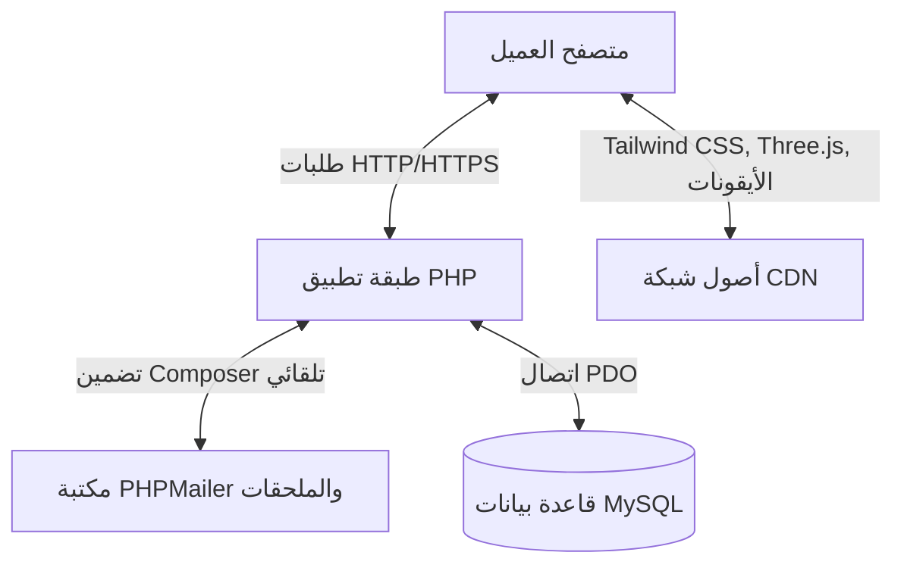
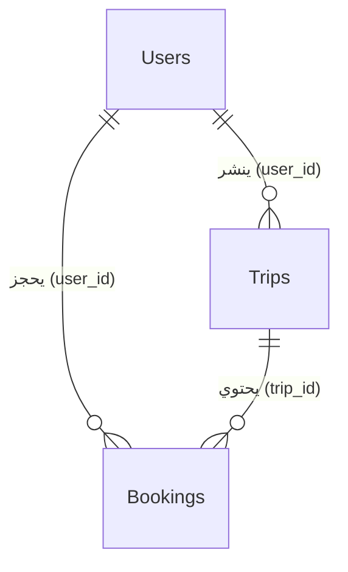

# دليل شرح الكود المصدري لمشروع
Rydo

مرحباً بك في التوثيق التقني الشامل لمشروع
Rydo
المعروف أيضاً باسم
Cyber Covoiturage
وهو تطبيق ويب متطور وحيوي للنقل التشاركي مصمم خصيصاً لمدينة سيدي بوزيد في تونس.

يقدم هذا المستند شرحاً تقنياً وتفصيلياً للبنية البرمجية، تصميم قاعدة البيانات، دورة حياة المستخدم، بروتوكولات الأمان، نظام إدارة المشرفين، بالإضافة إلى تفصيل برمجيات كل ملف داخل المشروع.

لتفادي مشاكل القراءة الناتجة عن تداخل اللغات، تم وضع المصطلحات والرموز الإنجليزية في أسطر منفصلة.

---

## 1. نظرة عامة على البنية البرمجية

يعتمد التطبيق على بنية برمجية حديثة مستوحاة من بيئة عمل:
**LAMP-stack**
مع طبقات منفصلة لضمان الكفاءة والأمان، حيث يجمع بين كود معالجة خلفي قوي وتصميم واجهات تفاعلية مستقبلية جذابة.

### التقنيات الأساسية المستخدمة:

*   **خلفية النظام:**
    PHP
    لإدارة جلسات العمل:
    Session State
    والحوسبة الإجرائية، وتشفير كلمات المرور.

*   **موصل قاعدة البيانات:**
    PHP Data Objects
    PDO
    مع تفعيل وضع معالجة الأخطاء الصارم، الاستعلامات المجهزة والمعلمة:
    Prepared Statements
    والعمليات المركبة:
    Transactions

*   **إدارة قاعدة البيانات:**
    MySQL
    مع قيود العلاقات وحذف البيانات المترابطة تلقائياً:
    Cascade Delete

*   **الواجهات والتصميم:**
    Tailwind CSS
    المهيأ بخصائص مستقبلية مخصصة للوضع المظلم، وتوهجات النيون مدمجاً مع ملف:
    Vanilla CSS
    مخصص للتنسيقات الكلاسيكية.

*   **التأثيرات البصرية:**
    Three.js
    لعرض خلفية سائلة متحركة تفاعلية عبر:
    WebGL
    ورسومات متجهة متجاوبة ومتحركة لمسارات الرحلات:
    SVG
    ورسم انتقالي دقيق مستوحى من لغة تصميم:
    Material 3

*   **محرك البريد الإلكتروني:**
    Composer
    لإدارة حزمة مكتبة:
    PHPMailer
    المرتبطة بخوادم إرسال البريد الإلكتروني:
    SMTP TLS
    المقدمة من:
    Gmail

---

## 2. مخطط قاعدة البيانات

تسمى قاعدة البيانات:
`covoiturage`
وهي مهيأة بترميز:
`utf8mb4`
وترتيب:
`utf8mb4_unicode_ci`
لدعم كامل للرموز واللغات. تتألف قاعدة البيانات من ثلاثة جداول أساسية مترابطة بعلاقات قوية:

### تفاصيل الجداول:

#### 1. جدول المستخدمين
`Users`
لتخزين بيانات التسجيل للرواد والركاب.

*   `id`
    المعرف الفريد للمستخدم:
    Unsigned
    تلقائي الزيادة.
*   `name`
    الاسم الكامل للمستخدم.
*   `email`
    البريد الإلكتروني الفريد الذي يستخدم كاسم مستخدم لتسجيل الدخول.
*   `password`
    كلمة المرور المشفرة بأمان عبر خوارزمية:
    PASSWORD_DEFAULT
    Bcrypt
*   `phone`
    رقم الهاتف المحمول للتواصل.
*   `role`
    رتبة الصلاحية داخل النظام؛ قيمتها الافتراضية:
    `user`
    وتتغير إلى:
    `admin`
    للمشرفين.
*   `profile_pic`
    مسار الصورة الشخصية المرفوعة على الخادم.
*   `reset_token_hash`
    و
    `reset_token_expires_at`
    الرمز المشفر ووقت انتهاء الصلاحية لإدارة استعادة كلمات المرور بأمان.

#### 2. جدول الرحلات
`Trips`
لتخزين الرحلات المعلنة بواسطة السائقين.

*   `id`
    المعرف الفريد للرحلة.
*   `user_id`
    المفتاح الأجنبي المرتبط بجدول المستخدمين. عند حذف حساب المستخدم، يتم تلقائياً حذف جميع الرحلات المرتبطة به عبر خاصية:
    `CASCADE`
*   `departure`
    و
    `destination`
    نقطة الانطلاق والوجهة المستهدفة.
*   `date_trip`
    تاريخ ووقت انطلاق الرحلة.
*   `seats`
    عدد المقاعد المتاحة بالسيارة للركاب.
*   `price`
    تكلفة الرحلة بالدينار التونسي.
*   `car_brand`
    و
    `offers`
    نوع السيارة والخدمات الإضافية المتاحة للركاب.

#### 3. جدول الحجوزات
`Bookings`
لتخزين المقاعد المحجوزة من قِبل الركاب.

*   `id`
    المعرف الفريد للحجز.
*   `user_id`
    المفتاح الأجنبي للمسافر المرتبط بجدول المستخدمين.
*   `trip_id`
    المفتاح الأجنبي للرحلة المرتبط بجدول الرحلات.
*   `status`
    حالة الحجز الحالية؛ قيمتها الافتراضية:
    `active`
    أو
    `cancelled`
    عند الإلغاء.

---

## 3. تفصيل وهيكلية ملفات المشروع

فيما يلي تحليل تفصيلي وبرمجي لكل ملف داخل مجلد مشروع
Rydo

### أ. إعدادات النظام الأساسية

#### 1. ملف الاتصال
[`db.php`](file:///C:/xampp/htdocs/project/db.php)
يمثل بوابة الاتصال بقاعدة البيانات. يقوم بإنشاء مثيل اتصال:
PDO
آمن.
*   **مصفوفة الإعدادات الخاصة بالاتصال:**
    *   `PDO::ATTR_ERRMODE => PDO::ERRMODE_EXCEPTION`
        لتمكين بيئة الاتصال من رمي استثناءات برمجية واضحة عند حدوث أي خطأ، مما يسهل معالجتها في كتل:
        try-catch
    *   `PDO::ATTR_DEFAULT_FETCH_MODE => PDO::FETCH_ASSOC`
        تهيئة جلب الصفوف كصفوف ترابطية لتسهيل قراءتها برمجياً.
    *   `PDO::ATTR_EMULATE_PREPARES => false`
        إيقاف الاستعلامات المجهزة الزائفة وإجبار الخادم على التحقق الفعلي من صحة الأكواد، مما يمنع ثغرات حقن:
        SQL

#### 2. ملف بناء الجداول
[`covoiturage.sql`](file:///C:/xampp/htdocs/project/covoiturage.sql)
المخطط الهيكلي لقاعدة البيانات. يحتوي على أوامر إنشاء الجداول وتعريف العلاقات البرمجية وتحديد محرك التخزين:
InnoDB

#### 3. ملفات إدارة المكتبات
[`composer.json`](file:///C:/xampp/htdocs/project/composer.json)
و
`composer.lock`
ملفات إدارة الحزم الخارجية للمشروع. يحددان الاعتماد على مكتبة:
`phpmailer/phpmailer: ^7.0`

---

### ب. إدارة حسابات المستخدمين وصلاحيات الدخول

#### 4. ملف التسجيل
[`register.php`](file:///C:/xampp/htdocs/project/register.php)
وحدة تسجيل وانضمام مستخدمين جدد.
*   **فحص التكرار:**
    يقوم بفحص قاعدة البيانات أولاً. وفي حال تطابق البريد، يتم إرجاع رمز الاستجابة:
    `409 Conflict`
    وعرض تنبيه منبثق للمستخدم للانتقال لصفحة تسجيل الدخول.
*   **تشفير كلمة المرور:**
    يتم حماية وتشفير كلمة المرور المدخلة عبر دالة:
    `password_hash`
    قبل كتابتها.
*   **إتمام التسجيل:**
    بعد كتابة البيانات بنجاح، يتم توجيه المستخدم لصفحة:
    `login.php`

#### 5. ملف تسجيل الدخول
[`login.php`](file:///C:/xampp/htdocs/project/login.php)
البوابة الآمنة لدخول وتفويض المستخدمين.
*   **تخطي المشرف المدمج:**
    يحتوي الملف على آلية تخطي سريعة؛ عند تسجيل الدخول بالبريد:
    `admin@gmail.com`
    وبكلمة المرور:
    `admin`
    يتم مباشرة إنشاء جلسة عمل للمشرف برتبة:
    `admin`
    وتوجيهه لصفحة:
    `admin_dashboard.php`
*   **التحقق الفعلي:**
    يتم استخدام الدالة البرمجية الآمنة:
    `password_verify()`
    للتحقق من تطابق كلمات المرور وحفظ معرّف واسم المستخدم في الجلسة:
    Session

#### 6. ملف تسجيل الخروج
[`logout.php`](file:///C:/xampp/htdocs/project/logout.php)
يقوم بتدمير كافة جلسات العمل المفتوحة برمجياً:
`session_destroy()`
وتوجيه المستخدم مجدداً لصفحة الترحيب الرئيسية:
`index.php`

#### 7. ملف رفع الصورة الشخصية
[`upload_profile.php`](file:///C:/xampp/htdocs/project/upload_profile.php)
معالج رفع الصور الشخصية اللامتزامن عبر تقنية:
AJAX
*   **التحقق من الصلاحية:**
    يمنع الزوار غير المسجلين عبر إرجاع رسالة استجابة بصيغة:
    JSON
*   **التدقيق الأمني:**
    يحصر امتدادات الملفات المرفوعة فقط في الصيغ التالية:
    `["jpg", "jpeg", "png", "webp"]`
*   **حفظ الملف:**
    يتفادى تعارض الأسماء عبر إعادة التسمية التلقائية إلى الصيغة:
    `profile_[user_id]_[timestamp].[extension]`
    ويخزنها في مجلد:
    `/uploads`

---

### ج. بروتوكولات استعادة كلمة المرور

#### 8. ملف طلب الاستعادة
[`forgot_password.php`](file:///C:/xampp/htdocs/project/forgot_password.php)
نقطة انطلاق بروتوكول استعادة الحسابات المغلقة.
*   **إنشاء الرمز الأمني:**
    يولد رمزاً عشوائياً مشفراً عبر:
    `random_bytes(16)`
    ويقوم بتخزين نسخته المشفرة بـ:
    `sha256`
    في قاعدة البيانات.
*   **إرسال البريد:**
    يستخدم مكتبة:
    `PHPMailer`
    لإرسال بريد إلكتروني ذو قالب تفاعلي يحتوي على رابط الاستعادة المباشر.
*   **بديل التطوير الذكي:**
    في حال فشل إرسال البريد، يقوم النظام تلقائياً بطباعة رابط الاستعادة مباشرة في لوحة التنبيهات الخاصة بالمطور لتسهيل الاختبار محلياً:
    Local Testing

#### 9. ملف تحديث كلمة المرور
[`reset_password.php`](file:///C:/xampp/htdocs/project/reset_password.php)
الخطوة النهائية لتسجيل كلمة المرور الجديدة للمستخدم.
*   **التحقق النشط:**
    يستلم الرمز من الرابط عبر:
    `$_GET['token']`
    ويقوم بمطابقته مع التحقق من صلاحية الوقت:
    `reset_token_expires_at > NOW()`
*   **تطهير الرموز:**
    عند تطابق المدخلات وتحديث كلمة المرور، يتم إرجاع قيم الرموز والتواريخ في قاعدة البيانات إلى:
    `NULL`
    لمنع هجمات إعادة التشغيل:
    Replay Attacks

---

### د. العمليات الأساسية: الرحلات والبحث

#### 10. ملف إضافة الرحلات
[`add_trip.php`](file:///C:/xampp/htdocs/project/add_trip.php)
بوابة نشر وإعلان الرحلات التشاركية.
*   يتيح للسائقين نشر تفاصيل رحلتهم شاملة الوجهة والمقاعد المتاحة والسعر ونوع السيارة والخدمات.
*   يسجل الرحلة مباشرة في جدول الرحلات مع ربطها ببيانات السائق في الجلسة.

#### 11. ملف البحث عن الرحلات
[`search.php`](file:///C:/xampp/htdocs/project/search.php)
محرك البحث والاستكشاف المركزي للرحلات.
*   **توليد الاستعلامات الديناميكي:**
    بناء استعلامات قاعدة البيانات بشكل متغير بناءً على محددات البحث.
*   **مرشحات وتصنيفات التبويبات:**
    *   `today`
        لعرض رحلات اليوم الحالي.
    *   `price`
        لتصنيف الرحلات تصاعدياً حسب السعر.
    *   `seats`
        لعرض الرحلات التي تحتوي على مقعدين شاغرين أو أكثر.
*   **الواجهة الديناميكية:**
    لوحة تفصيلية منبثقة تعمل برمجياً بلغة:
    JavaScript
    لعرض الرحلة وإمكانية حجزها فوراً.

#### 12. ملف رحلاتي المفتوحة
[`my_trips.php`](file:///C:/xampp/htdocs/project/my_trips.php)
يستعرض جميع الإعلانات والرحلات التي قام المستخدم الحالي بنشرها على المنصة.

---

### هـ. عمليات حجز المقاعد

#### 13. ملف حجز مقعد
[`book.php`](file:///C:/xampp/htdocs/project/book.php)
محرك إتمام حجز الرحلات.
*   يفحص جدول الرحلات أولاً للتأكد من وجود مقاعد شاغرة للرحلة المحددة.
*   يقوم بإدراج سجل حجز جديد في جدول الحجوزات.
*   يخصم مقعداً واحداً من الرحلة برمجياً:
    `seats = seats - 1`

#### 14. ملف إلغاء حجز
[`cancel_booking.php`](file:///C:/xampp/htdocs/project/cancel_booking.php)
معالج إلغاء الحجوزات.
*   يبحث عن سجل الحجز الفعال المطابق لبيانات الراكب.
*   يغير حالة الحجز في قاعدة البيانات برمجياً إلى:
    `cancelled`
*   يعيد إضافة مقعد شاغر للرحلة الأصلية مجدداً:
    `seats = seats + 1`

#### 15. ملف حجوزاتي
[`my_bookings.php`](file:///C:/xampp/htdocs/project/my_bookings.php)
يستعرض قائمة بكافة الحجوزات التي قام المسافر بحجزها مع بيان حالتها الحالية.

---

### و. مركز تحكم المشرفين

#### 16. لوحة التحكم للمشرف
[`admin_dashboard.php`](file:///C:/xampp/htdocs/project/admin_dashboard.php)
لوحة العمل المتكاملة لمشرفي النظام.
*   **جدار الحماية الأمني:**
    يتأكد من رتبة وصلاحية المستخدم النشط في الجلسة:
    `admin`
    قبل معالجة الصفحة.
*   **لوحة الإحصائيات الفورية:**
    تقوم بحساب إجمالي الأعضاء، والرحلات النشطة، وحجم الحركة المالي الكلي بالدينار التونسي.
*   **الحذف التتابعي الآمن:**
    تُنفذ العمليات تحت مظلة حماية متكاملة:
    `PDO::beginTransaction()`
    لضمان حذف كافة السجلات التابعة للمستخدم دفعة واحدة، مع إمكانية التراجع الفوري عن الحذف في حال فشل أي خطوة:
    `rollBack()`
*   **لوحة تعديل البيانات الجانبية:**
    واجهة تحرير جانبية منبثقة تتيح للمشرف تعديل الأسماء، الحسابات، وصلاحية الحساب بشكل مباشر وسلس.

---

### ز. الواجهات، التصاميم، والبنية الثابتة

#### 17. ملف رأس الصفحة الموحد
[`header.php`](file:///C:/xampp/htdocs/project/header.php)
الهيكل الأساسي والعلوي للموقع الإلكتروني، ويتم تضمينه تلقائياً في مقدمة جميع ملفات العرض.
*   **حارس الجلسات الآمن:**
    يبدأ تشغيل جلسات العمل البرمجية بأمان عبر فحص حالتها أولاً.
*   **أنماط التصميم المستقبلية:**
    يُعرف متغيرات واجهات الزجاج البلوري وحقول المدخلات المتميزة والنوافذ المنبثقة.
*   **واجهة الترحيب الأولى:**
    لوحة تحميل كاملة الشاشة تستعرض رسوم شاحنة متحركة، وتستخدم ملفات:
    `localStorage`
    بالمتصفح لتخزين حالة المشاهدة لكي لا تظهر مجدداً للمستخدم وتسبب إزعاجه في نفس الجلسة.

#### 18. ملف نهاية الصفحة الموحد
[`footer.php`](file:///C:/xampp/htdocs/project/footer.php)
الجزء السفلي الموحد لصفحات الموقع ويحتوي على روابط السياسات والشروط ومعلومات الملكية الفكرية.

#### 19. ملف الصفحة الرئيسية
[`index.php`](file:///C:/xampp/htdocs/project/index.php)
الصفحة الرئيسية للمشروع والمدخل الأساسي للمنصة.
*   **خلفية التفاعل السائل:**
    ينشئ حاوية عرض:
    WebGL
    بالخلفية تعمل على معالجة إحداثيات حركة مؤشر الفأرة وتمريرها لخوارزميات التظليل لرسم تأثيرات مائية تتموج وتتحرك ديناميكياً مع الفأرة.
*   **الرحلات النشطة المباشرة:**
    يجلب من قاعدة البيانات أحدث 6 رحلات معلنة ومتاحة لعرضها للزوار مباشرة.

#### 20. ملف اتصل بنا
[`contact.php`](file:///C:/xampp/htdocs/project/contact.php)
صفحة الدعم والتواصل تحتوي على معلومات التواصل الفوري، هاتف المساعدة، وعناوين البريد الإلكتروني للدعم التقني.

#### 21. ملفات الخصوصية والشروط
[`privacy.php`](file:///C:/xampp/htdocs/project/privacy.php)
و
[`terms.php`](file:///C:/xampp/htdocs/project/terms.php)
صفحات الشروط وسياسات الخصوصية، وتتضمن التنويه الأكاديمي بأن التطبيق تم تصميمه وبناؤه كمشروع أكاديمي وتعليمي لصالح:
المعهد العالي للدراسات التكنولوجية بسيدي بوزيد
ISET Sidi Bouzid

#### 22. ملف التنسيقات الكلاسيكي
[`style.css`](file:///C:/xampp/htdocs/project/style.css)
يحتوي على خصائص تنسيق مستوحاة من لغة تصميم آبل الهادئة والأنيقة، ويتم استدعاؤها في بعض واجهات لوحة التحكم القديمة لتهيئة البطاقات وعناصر الإدخال والظلال.

---

## 4. التدابير الأمنية المطبقة في النظام

*   **الوقاية من ثغرات حقن الاستعلامات:**
    يتم معالجة جميع الاستعلامات التي تستقبل بيانات من المستخدمين بشكل صارم عبر الاستعلامات المجهزة والمعلمة في بيئة:
    PDO
    ويُحظر تماماً تمرير المتغيرات النصية بشكل مباشر داخل كود الاستعلام.

*   **تشفير كلمات المرور:**
    لا يتم تخزين أي كلمة مرور بنصها الصريح؛ حيث يتم تشفيرها بخوارزمية التشفير المتطورة والآمنة:
    Bcrypt
    عبر دالات التشفير والمطابقة الرسمية في لغة المعالجة.

*   **أمان رفع الملفات والصور:**
    يقوم النظام بالتحقق الصارم من امتدادات ونوعية الملفات المرفوعة لتجنب رفع ملفات برمجية ضارة قد تُنفذ على الخادم.

*   **التحقق من هوية وصلاحية الجلسات:**
    يتم حماية الملفات الحساسة مثل لوحة تحكم المشرفين أو عمليات الحجز وإلغاء الرحلات بفحص الجلسات للتأكد من هويتها ورتبتها، وتوجيه الحسابات غير المصرح لها إلى الخارج فوراً.

*   **سلامة وتكامل العمليات المالية والإدارية:**
    تُنفذ العمليات الحساسة التي تتطلب تعديلات متعددة في الجداول بشكل متكامل ومتتالي تحت حماية نظام المعالجة المركبة لضمان تراجع قاعدة البيانات عن كافة الخطوات تلقائياً في حال فشل أي جزء من العملية.
